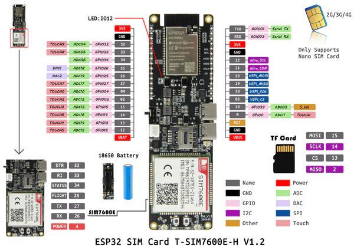
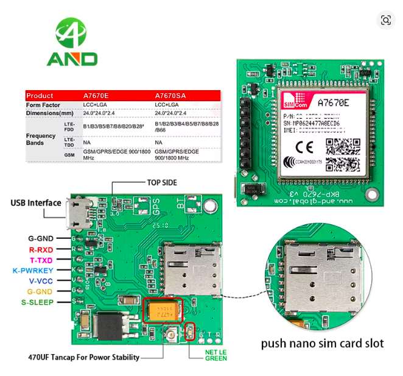
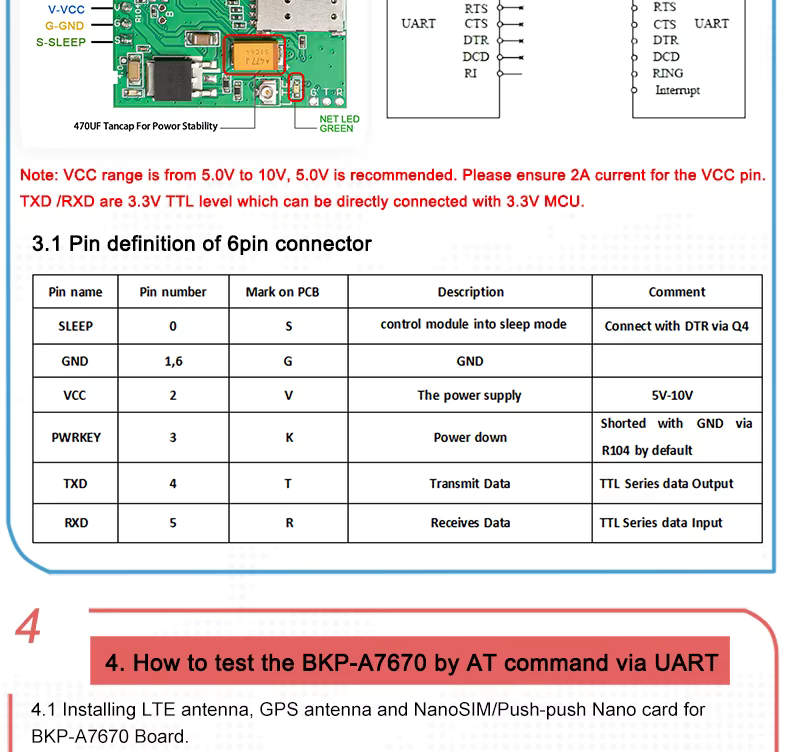
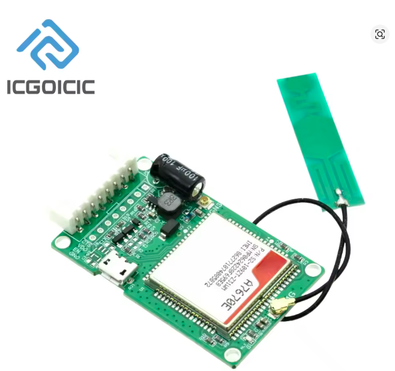

# ESPHome Modem Packages for Development Boards

This repository provides ready-to-use ESPHome packages for popular ESP32 development boards with integrated cellular modems. These packages simplify the configuration of cellular connectivity by automatically configuring the modem hardware with the appropriate pins and settings.

## About

These packages are designed to work with the ESPHome modem component, which provides cellular TCP/IP connectivity for ESP32-based devices over 4G/LTE networks.

**Related ESPHome Pull Requests:**
- [#6721 - [modem] pppos tcp/ip for UART modem (esp32)](https://github.com/esphome/esphome/pull/6721)
- [#7147 - [wifi, ethernet] Allow Wifi AP to reuse existing network interface (ethernet or modem) for NAT](https://github.com/esphome/esphome/pull/7147)

**Documentation:** [ESPHome Modem Component](https://deploy-preview-4056--esphome.netlify.app/components/modem/)

### Important: Network Configuration

⚠️ **These configuration packages do not include complete network setup.**

When using a cellular modem, your device receives a **private IP address** from the mobile carrier, making it unreachable from the internet. This prevents direct connections for OTA updates via the API component.

**You must configure one of the following solutions:**

**Option 1: MQTT (Recommended)**
- Configure an MQTT broker that is accessible from the internet (without firewall restrictions)
- For OTA updates with MQTT, use the HTTP Request OTA platform
- Documentation: [ESPHome OTA HTTP Request](https://esphome.io/components/ota/http_request/#_top)

**Option 2: WireGuard + API (Less Recommended)**
- Set up a WireGuard VPN tunnel to create a private network connection
- Use the standard ESPHome API for communication and OTA updates
- Documentation: [ESPHome WireGuard](https://esphome.io/components/wireguard)

### Important: GPS/GNSS Considerations

⚠️ **GPS/GNSS support with cellular modems is more complex than standalone GPS modules.**

When a modem sits between the ESP32 and the GNSS receiver, the direct UART access to NMEA sentences (as used by the standard [ESPHome GPS component](https://esphome.io/components/gps/#_top)) is not available. The modem firmware controls GNSS access, creating several challenges:

**Implementation Challenges:**
- The GNSS UART is hidden behind the modem's AT command interface
- NMEA sentences must be retrieved either:
  - Via **Unsolicited Result Codes (URC)** - when supported, the modem forwards NMEA frames automatically (best method)
  - By **parsing proprietary formats** like `AT+CGNSSINFO` responses, which vary between modem models and firmware versions
- Non-standard formats require complex parsing and conversion to NMEA format
- GNSS support and data format can change between firmware versions of the same modem model

**Simcom Firmware Variants:**
- Some Simcom firmware versions are "lightened" and **lack GNSS support entirely**, even when the hardware connector is present
- **To verify GNSS support:** Use the `ATI` command and check if the firmware version ends with `_F` (for "Full")
  - Example: `SIM7600M22_V2.0_210630_F` → GNSS supported ✅
  - Example: `SIM7600M22_V2.0_210630` → GNSS not supported ❌

**Recommendation:** When possible, choose boards with modems that support native NMEA forwarding via URC (like the LilyGo T-SIM7600).

---

## Supported Boards

### Board Comparison

| Board | Modem Model | GPS/GNSS | Power Pin | Status Pin | Flow Control | Notes |
|-------|-------------|----------|-----------|------------|--------------|-------|
| **LilyGo T-SIM7600** | SIM7600 | ✅ Native | ✅ Inverted | ✅ GPIO34 | ❌ | Best GPS support via URC |
| **AND SIM7670** | SIM7670 | ⚠️ Tricky | ⚠️ Unclear | ⚠️ Unclear | ✅ G/T/R pins | Requires manual NMEA conversion |
| **ICGOICIC A7670X** | SIM7670 | ❌ Not available | ⚠️ Unclear | ⚠️ Unclear | ❌ | Non-full firmware, ESP32 powered |
| **Waveshare ESP32-S3-A7670E** | SIM7670 | ❌ Buggy | ❌ | ❌ | ❌ | GPS broken with SIM card inserted |

**Legend:**
- ✅ = Fully supported
- ⚠️ = Partially supported or requires workarounds
- ❌ = Not supported or not working

---

## Board Details

### LilyGo T-SIM7600



**Product Page:** [LilyGo T-SIM7600](https://lilygo.cc/en-us/products/t-sim7600)

**Features:**

- **Modem:** SIM7600 (4G Cat-1)
- **GPS/GNSS:** ✅ **Excellent support** via modem Unsolicited Result Codes (URC)
- **Power Control:** GPIO4 (inverted)
- **Status Pin:** GPIO34
- **Flight Mode:** GPIO25 (inverted)
- **Status LED:** GPIO12

**Pin Configuration:**

| Function | ESP32 Pin | Modem Pin |
|----------|-----------|-----------|
| UART RX | GPIO26 | TX |
| UART TX | GPIO27 | RX |
| Power Key | GPIO4 (inverted) | PWK |
| Status | GPIO34 | STATUS |
| Flight Mode | GPIO25 (inverted) | - |
| Status LED | GPIO12 | - |

**GPS/GNSS Support:**

The SIM7600 modem provides **native GPS support** through NMEA sentences delivered via Unsolicited Result Codes. The package automatically:
1. Powers on GPS with `AT+CGPS=1`
2. Configures NMEA output (`AT+CGPSINFOCFG=10,3`) for GPGGA and GPRMC sentences every 10 seconds
3. Forwards NMEA data to the ESPHome GPS component

**Package:** [`packages/lilygo_tsim7600.yaml`](packages/lilygo_tsim7600.yaml)
**Example:** [`examples/lilygo_tsim7600.yaml`](examples/lilygo_tsim7600.yaml)

---

### AND SIM7670 Development Board

 

**Product Link:** [AliExpress - AND SIM7670](https://fr.aliexpress.com/item/1005008863882741.html)

**Features:**

- **Modem:** SIM7670 (4G Cat-1)
- **GPS/GNSS:** ⚠️ **Requires manual conversion** from `AT+CGNSSINFO` to NMEA
- **Power Pin:** ⚠️ K pin - connection status unclear
- **Status Pin:** ⚠️ S pin - connection status unclear
- **Hardware Flow Control:** ✅ Unpopulated G/T/R pins available

**Pin Configuration:**

| Function | ESP32 Pin | Modem Pin | Notes |
|----------|-----------|-----------|-------|
| UART RX | GPIO21 | TXD | Or GPIO3 for HW UART |
| UART TX | GPIO22 | RXD | Or GPIO1 for HW UART |
| Status | GPIO17 | S | ⚠️ May not be connected |
| Power | - | K | ⚠️ May not be connected |
| Flow Control | - | G/T/R | Requires soldering |

**Power Requirements:**

⚠️ **External 5V power required!** The ESP32 may not provide sufficient power to the modem. Connect:
- External 5V to modem **V** pin (or via USB)
- ESP32 GND to modem **GND** pin
- ESP32 3.3V to modem **Vdd** pin

**LED Indicators:**

| LED | State | Meaning |
|-----|-------|---------|
| 🟢 Green | Solid | Modem powered on |
| 🟢 Green | Blinking | Modem connected to network |
| 🔵 Blue | Solid | GNSS powered on |
| 🔵 Blue | Blinking | GNSS has fix |

**GPS/GNSS Support:**

The SIM7670 on this board does **not provide native NMEA output**. The package includes a complex lambda function that:
1. Queries modem position with `AT+CGNSSINFO`
2. Parses the CSV response
3. Converts decimal degrees to NMEA format
4. Generates GPGGA and GPRMC sentences with checksums
5. Feeds synthetic NMEA data to the GPS component

This runs every 20 seconds via an interval component.

⚠️ **Note:** Users report that pins S (status) and K (power) may not be properly connected on this board. Please report if you successfully use them!

**Package:** [`packages/and_A7670.yaml`](packages/and_A7670.yaml)
**Example:** [`examples/and_A7670.yaml`](examples/and_A7670.yaml)

---

### Waveshare ESP32-S3-A7670E-4G-EN

**Product Page:** [Waveshare ESP32-S3-A7670E-4G](https://docs.waveshare.com/ESP32-S3-A7670E-4G)

**Features:**

- **ESP32 Variant:** ESP32-S3
- **Modem:** SIM7670E (4G Cat-1)
- **GPS/GNSS:** ❌ **Non-functional** due to firmware bug with SIM card
- **Power Pin:** Not available
- **Status Pin:** Not available
- **Hardware UART:** UART1 (TX: GPIO18, RX: GPIO17)

**Pin Configuration:**

| Function | ESP32 Pin | Modem Pin |
|----------|-----------|-----------|
| UART RX | GPIO17 | TX |
| UART TX | GPIO18 | RX |
| Modem Active | GPIO21 | - |
| USB D+ | - | USB_DP |
| USB D- | - | USB_DN |

**Known Issues:**

❌ **GPS/GNSS Firmware Bug:** The A7670E modem firmware on this board has a critical bug that breaks all GPS-related AT commands when a SIM card is inserted.

**Symptom:**
```
# With SIM card inserted:
AT+CGNSSPWR=1
OK
+CGNSSPWR: READY!
AT+CGNSSPROD
AT+CGNSSPROD ,,          # Empty response

# Without SIM card:
AT+CGNSSPROD
AT+CGNSSPROD PRODUCT: UNICORECOMM,UC6228CI,R3.4.21.0Build16211  # Normal response
```

All GPS commands (`AT+CGNSSPWR`, `AT+CGNSSINFO`, `AT+CGNSSPROD`, etc.) return empty tokens when a SIM card is present.

**USB Interface:**

The board exposes USB D+/D- pins connected to the modem, which could potentially be used for NMEA sentence retrieval. However, ESPHome does not yet have a USB host component to interface with this.

**AT Command Manual:** [A7670E AT Command Manual](https://files.waveshare.com/wiki/A7670E-Cat-1-GNSS-HAT/A76XX_Series_AT_Command_Manual_V1.09.pdf)

**Package:** [`packages/waveshare_ESP32-S3-A7670E-4G.yaml`](packages/waveshare_ESP32-S3-A7670E-4G.yaml)
**Example:** [`examples/waveshare_ESP32-S3-A7670E-4G.yaml`](examples/waveshare_ESP32-S3-A7670E-4G.yaml)

---

### ICGOICIC A7670X Development Board



**Product Link:** [AliExpress - ICGOICIC A7670X](https://fr.aliexpress.com/item/1005007787671055.html)

**Features:**

- **Modem:** SIM7670 (4G Cat-1)
- **GPS/GNSS:** ❌ **Not available** (firmware doesn't end with `_F`)
- **Power Pin:** ⚠️ K pin - connection status unclear
- **Status Pin:** ⚠️ S pin - connection status unclear
- **Hardware Flow Control:** ❌ Not available

**Pin Configuration:**

| Function | ESP32 Pin | Modem Pin | Notes |
|----------|-----------|-----------|-------|
| UART RX | GPIO21 | TXD | Or GPIO3 for HW UART |
| UART TX | GPIO22 | RXD | Or GPIO1 for HW UART |
| Status | GPIO17 | S | ⚠️ May not be connected |
| Power | - | K | ⚠️ May not be connected |

**Power Requirements:**

✅ **Can be powered by ESP32!** Unlike the AND SIM7670 board, this board includes a capacitor and has no GNSS module, allowing it to be powered directly from the ESP32:
- ESP32 GND to modem **GND** pin
- ESP32 3.3V to modem **Vdd** pin

Alternatively, you can use external 5V power:
- External 5V to modem **V** pin (or via USB)
- ESP32 GND to modem **GND** pin
- ESP32 3.3V to modem **Vdd** pin

**LED Indicators:**

| LED | State | Meaning |
|-----|-------|---------|
| 🟢 Green | Solid | Modem powered on |
| 🟢 Green | Blinking | Modem connected to network |

**GPS/GNSS Support:**

❌ **Not available.** This board uses a non-full firmware version (doesn't end with `_F`). Check with the `ATI` command to verify your firmware version.

⚠️ **Note:** If you have tested this board with a "Full" firmware version that supports GNSS, please report your findings so this documentation can be updated!

⚠️ **Note:** Users report that pins S (status) and K (power) may not be properly connected on this board. Please report if you successfully use them!

**Package:** [`packages/ICGOICIC_A7670X.yaml`](packages/ICGOICIC_A7670X.yaml)
**Example:** [`examples/ICGOICIC_A7670X.yaml`](examples/ICGOICIC_A7670X.yaml)

---

## Advanced Configuration

### Improving Data Transfer Performance

For faster data transfer or to resolve issues with large transfers, enable `CONFIG_UART_ISR_IN_IRAM`:

```yaml
esp32:
  framework:
    type: esp-idf
    sdkconfig_options:
      CONFIG_UART_ISR_IN_IRAM: y
      CONFIG_ESP_TASK_WDT_TIMEOUT_S: "60"
```

⚠️ **Warning:** This conflicts with the UART component and may cause crashes if you're using multiple UARTs.

### CMUX Payload Issues

If you encounter "CMUX: Failed to defragment longer payload" warnings:

```yaml
esp32:
  framework:
    type: esp-idf
    sdkconfig_options:
      CONFIG_ESP_MODEM_CMUX_DEFRAGMENT_PAYLOAD: n
      CONFIG_ESP_MODEM_USE_INFLATABLE_BUFFER_IF_NEEDED: y
      CONFIG_ESP_MODEM_CMUX_USE_SHORT_PAYLOADS_ONLY: n
```

---

## Resources

### ESPHome Documentation
- [Modem Component](https://deploy-preview-4056--esphome.netlify.app/components/modem/)
- [GPS Component](https://esphome.io/components/gps)
- [MQTT](https://esphome.io/components/mqtt)
- [Wireguard](https://esphome.io/components/wireguard)

### Modem Datasheets
- [SIM7600 AT Command Manual](https://simcom.ee/documents/SIM7600C/SIM7500_SIM7600%20Series_AT%20Command%20Manual_V1.01.pdf)
- [SIM7600 Hardware Design](https://simcom.ee/documents/SIM7600E/SIM7600%20Series%20Hardware%20Design_V1.03.pdf)
- [A7670E AT Command Manual](https://files.waveshare.com/wiki/A7670E-Cat-1-GNSS-HAT/A76XX_Series_AT_Command_Manual_V1.09.pdf)

### ESP-IDF
- [esp_modem Library](https://docs.espressif.com/projects/esp-protocols/esp_modem/docs/latest/)

---

## Contributing

Contributions are welcome! If you have:
- Successfully used pins that are marked as unclear
- Found workarounds for known issues
- Support for additional boards
- Improvements to existing packages

**Get in touch:**
- Open an issue or pull request on GitHub
- Join the discussion on Discord: [ESPHome Modem Discussion](https://discord.com/channels/429907082951524364/1238611620545167401)

---
